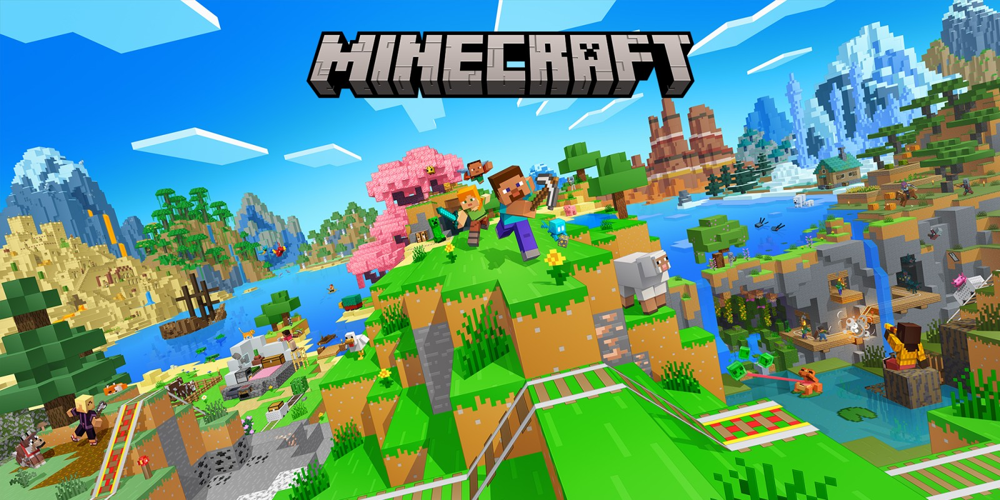

# CTM Laucher

[](https://github.com/shalom25/CTM-Launcher-java-Minecraft/releases)
[](https://github.com/shalom25/CTM-Launcher-java-Minecraft/releases/latest)
[](https://github.com/shalom25/CTM-Launcher-java-Minecraft/releases/latest)
[](https://github.com/shalom25/CTM-Launcher-java-Minecraft/blob/main/LICENSE.txt)

Launcher de escritorio para Windows orientado a Minecraft Java.



## Descarga

- [Descargar portable](https://github.com/shalom25/CTM-Launcher-java-Minecraft/releases/tag/portable)
- [Descargar instalador](https://github.com/shalom25/CTM-Launcher-java-Minecraft/releases/tag/setup)
- [Ver todas las releases](https://github.com/shalom25/CTM-Launcher-java-Minecraft/releases)

## Requisitos

- Windows 10 o superior.
- Java instalado o ruta de Java configurada manualmente.
- Conexion a internet para descargar archivos de Minecraft y sincronizar noticias.

## Incluye

- Login offline por nickname.
- Selector de versiones oficiales desde Mojang.
- Ajustes de memoria RAM.
- Configuracion de ruta de Java.
- Carpeta de juego dedicada.
- Panel de noticias.
- Registro de actividad en tiempo real.
- Boton para descargar la version seleccionada.
- Boton para lanzar Minecraft Java con `minecraft-launcher-core`.

## Instalacion Rapida

- `Portable`: descarga `CTM.Laucher.exe` y ejecútalo directamente.
- `Instalador`: descarga `CTM.Launcher.Setup.exe` y sigue el asistente.
- Si Windows muestra advertencia por firma, pulsa `Mas informacion` y luego `Ejecutar de todos modos`.

## Estructura

- `electron/main.js`: backend principal, IPC, ajustes y logica de lanzamiento.
- `electron/preload.js`: puente seguro entre Electron y la interfaz.
- `renderer/index.html`: interfaz principal.
- `renderer/app.js`: logica de UI.
- `renderer/styles.css`: estilos del launcher.

## Ejecutar

```bash
npm install
npm start
```

## Empaquetar

```bash
npm run dist
```

## Notas

- Esta base usa login offline. Si quieres, el siguiente paso natural es integrar login Microsoft.
- Para lanzar Minecraft necesitas tener Java instalado y accesible desde `java` o indicar su ruta manualmente.
- La descarga de archivos del juego y el arranque usan `minecraft-launcher-core`.
- Las noticias remotas se cargan desde `news.json` en GitHub.
